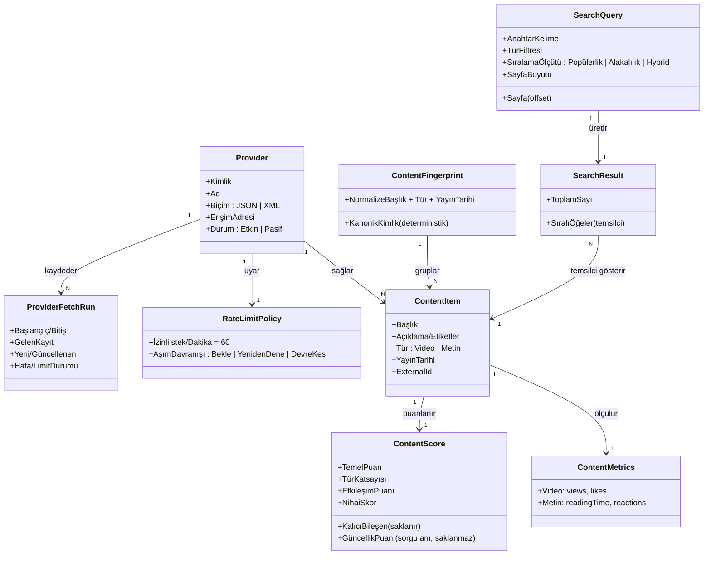

# REASONS Kanvas: Çoklu Sağlayıcılı İçerik Arama ve Puanlama Servisi

> Modül: `content-search` · Faz: B (Kanvas — İş Yüzü) · Tarih: 2026-08-27
> Kaynak: `docs/spdd/content-search/01-analysis.md` (Faz A) + A→B kapısı cevapları (S1–S9)
> Bu doküman modülün **doğruluk kaynağıdır**. İleride hata ya da değişiklik çıktığında önce buraya bakılır.
> Her boyutun **teknik yüzü Faz C'ye** (`03-build-plan.md`) bırakılmıştır ("Teknik yüz → Faz C" notlarıyla).

## A→B Kapısı — Kilitlenen Kararlar

Faz A'daki dokuz açık soru kullanıcıyla kapatıldı. Bu Kanvas aşağıdaki kararlar üzerine kuruludur:

| # | Karar | Kanvasta nereye işlendi |
|---|---|---|
| S1 | Skor iki parçalı: **kalıcı bileşen saklanır, güncellik puanı sorgu anında** hesaplanır. | Approach · Norms · Entities |
| S2 | Sıralama üç seçenek: **Popülerlik**, **Alakalılık**, bonus **Hybrid** (ağırlıklı). | Requirements · Operations · Norms |
| S3 | Sağlayıcılar arası tekilleştirme **v1 kapsamında**, ancak **deterministik "içerik parmak izi"** ile (bulanık eşleştirme değil). | Entities · Norms · Safeguards · Operations |
| S4 | Çekim **iki yolla** tetiklenir: korumalı **manuel uç** + uygulama içi **zamanlanmış iş**. | Approach · Operations |
| S5 | Formülün tanımsız uçlarında (sıfıra bölme, eksik/negatif ölçüt) **ilgili puan bileşeni 0**; kural birim testle kilitli. | Norms · Safeguards |
| S6 | Sağlayıcı istek limiti varsayılanı **60 istek/dk**, yapılandırılabilir. | Norms · Safeguards |
| S7 | **Offset tabanlı** sayfalama. | Requirements · Operations · Norms |
| S8 | **Okuma açık, yazma uçları ApiKey** + gelen istek limiti. | Safeguards · Operations |
| S9 | Demo veri hacmi **sağlayıcı başına ~250–500 içerik**. | Requirements · Safeguards |

---

## R — Requirements (Gereksinimler)

### Çekirdek problem

Farklı biçimlerde (JSON, XML) ve farklı puanlama mantığıyla veri sunan birden çok içerik
sağlayıcısını, kullanıcıya **tek, tutarlı ve sıralanabilir** bir arama deneyimi olarak birleştirmek.
Kullanıcı bir anahtar kelime yazar; sistem tüm sağlayıcılardan toplanmış içerikleri ortak bir
puanlama modeline çevirip, ilgili ve popüler olanları üste alarak, filtrelenebilir ve sayfalanabilir
biçimde sunar.

### İş değeri

Değer üç iddiada toplanır: (1) sağlayıcı çeşitliliği kullanıcıdan **gizlenir** — kullanıcı "JSON
sağlayıcısı / XML sağlayıcısı" diye bir şey bilmez, tek bir içerik havuzu görür; (2) sıralama
**açıklanabilir ve tutarlı**dır — aynı sorgu aynı anda hep aynı sırayı verir, skorun neden o
olduğu gösterilebilir; (3) sisteme **yeni sağlayıcı eklemek ucuzdur** — çekirdek iş mantığına
dokunmadan genişler. Bu üç iddia, işin rekabet ettiği asıl beklentidir (case'in ölçtüğü yetenek).

### Aktörler

| Aktör | Kim / ne | Sistemle ilişkisi |
|---|---|---|
| **Arama Kullanıcısı** | Dashboard'u kullanan son kullanıcı | Anahtar kelimeyle arar, türe göre filtreler, sıralama ölçütü seçer, sayfalar arasında gezer. |
| **İçerik Sağlayıcı** | Dış JSON/XML kaynak (mock) | Sisteme ham içerik ve ölçüt verisi sağlar; istek limiti ve erişilebilirliği vardır. |
| **Operatör / Bakımcı** | Sistemi işleten kişi (aday/değerlendirici) | Çekimi elle tetikler, çekim çalıştırmalarını ve hata/limit durumlarını gözlemler, yeni sağlayıcı tanımlar. |
| **Zamanlanmış İş** | Sistem içi otomatik tetikleyici | Periyodik olarak çekimi başlatır (insan müdahalesi olmadan tazeleme). |

### Ölçülebilir kabul kriterleri

Bu kriterler modülün "bitti" tanımıdır. Teknik yüz (uç adları, imzalar, sorgular) → Faz C.

1. **Arama & filtre:** Bir anahtar kelime ve isteğe bağlı tür filtresi (Video | Metin) verildiğinde,
   sistem yalnızca eşleşen içerikleri döndürür; tür filtresi verilmezse iki tür de gelir.
2. **Sıralama:** Kullanıcı üç sıralama ölçütünden birini seçebilir — **Popülerlik**, **Alakalılık**,
   **Hybrid** (bonus). Seçilen ölçüte göre sonuç sırası deterministik olarak değişir; eşit skorlarda
   ikincil ve kararlı bir sıra ölçütü uygulanır (aynı sorgu → aynı sıra).
3. **Sayfalama:** Sonuçlar **offset tabanlı** sayfalanır; her sayfa istenen boyutta gelir ve toplam
   sonuç sayısı bilinir. Ardışık sayfalar arasında bir kaydın atlanması ya da tekrar görünmesi olmaz.
4. **Puanlama doğruluğu:** Her içeriğin nihai skoru, case formülünün her dalı (Video/Metin, dört
   güncellik aralığı, etkileşim) için doğru hesaplanır; ara bileşenler (temel, katsayı, güncellik,
   etkileşim) ayrı ayrı görülebilir ve "bu skor neden bu?" sorusu yanıtlanabilir.
5. **Güncellik tutarlılığı:** Aynı içeriğin skoru, veri hiç değişmese bile yayın tarihi eşiği
   geçildiğinde (1 hafta / 1 ay / 3 ay) doğru şekilde düşer; sıralama her sorguda güncel zamana göre
   doğrudur.
6. **Çok sağlayıcı birleştirme:** İki sağlayıcıdan (JSON + XML) gelen içerikler tek havuzda,
   sağlayıcı biçiminden bağımsız aynı kanonik temsille aranabilir.
7. **Tekilleştirme:** Aynı içerik iki sağlayıcıda bulunuyorsa, arama sonucunda **tek bir temsilci
   kayıt** gösterilir; kaç sağlayıcıda bulunduğu bilgisi kullanıcıya sunulabilir.
8. **Genişletilebilirlik:** Üçüncü bir sağlayıcı, **çekirdek iş kurallarına tek satır dokunmadan**
   (yalnızca yeni bir adaptör + yapılandırma kaydı ile) sisteme eklenebilir.
9. **Uç durum dayanıklılığı:** Bozuk/eksik ölçütlü (ör. `views=0`, eksik alan) tek bir kayıt, arama
   isteğinin tamamını düşürmez; ilgili puan bileşeni 0 kabul edilerek kayıt yine listelenir.
10. **Dashboard:** Basit web arayüzü içeriği en az **Başlık, İçerik Türü, Skor** ile listeler ve
    seçilen sıralama ölçütüne göre sıralar.
11. **Demo bütünlüğü:** Sistem, sağlayıcı başına ~250–500 içerikle dolu, canlı ve açılıp
    denenebilir bir demo olarak çalışır.

**Teknik yüz → Faz C:** uç noktalar, istek/yanıt şemaları, sorgu planları, indeks kararları,
DTO ve imzalar.

---

## E — Entities (İş Alanı Modeli)

Aşağıdaki nesneler işin ortak dilidir (bkz. `.claude/context/terminology.md`). Nitelikler
**iş anlamıyla** verilmiştir; saklama biçimi, tipler ve teknik anahtarlar → Faz C.

### İş nesneleri

- **Provider (İçerik Sağlayıcı):** Dış içerik kaynağı. Kimliği, insan-okur adı, veri biçimi
  (JSON | XML), erişim adresi, istek limiti politikası ve etkin/pasif durumu vardır. Yeni sağlayıcı
  = yeni adaptör + yapılandırma kaydı (kod dalı değil).
- **ContentItem (İçerik):** Sistemin kanonik içerik nesnesi; sağlayıcı biçiminden bağımsız tek
  temsil. Başlık, açıklama/etiketler, tür (Video | Metin), yayın tarihi, kaynak sağlayıcı ve
  sağlayıcıdaki kimliği (ExternalId). Ayrıca ait olduğu **içerik parmak izi** (aşağıda).
- **ContentMetrics (Etkileşim Ölçütleri):** İçeriğin ham sayaçları; **türe göre farklı set** —
  Video: `views`, `likes`; Metin: `readingTime`, `reactions`. Puanlamanın tek girdi kaynağıdır.
  Türe uymayan ölçüt bu nesnede anlamsızdır (tür-özel geçerlilik kuralı).
- **ContentScore (Puan):** Formülün çıktısı ve ara bileşenleri — temel puan, tür katsayısı,
  etkileşim puanı, **kalıcı bileşen** (bu üçünün türevi) ve nihai skorun **saklanan kısmı**.
  Güncellik puanı burada **saklanmaz**; sorgu anında zamana göre eklenir (S1). "Skor neden bu?"
  açıklanabilirliği bu ara bileşenlerden gelir.
- **ContentFingerprint (İçerik Parmak İzi):** Sağlayıcılar arası tekilleştirmenin iş nesnesi (S3).
  Normalize başlık + tür + yayın tarihi (varsa kaynak URL) üzerinden **deterministik** üretilen
  kanonik kimlik. Aynı parmak izine düşen ContentItem'lar "aynı içerik"tir. Bulanık/semantik değil,
  normalize-eşleşme temellidir; sınırı bilinçlidir.
- **ProviderFetchRun (Çekim Çalıştırması):** Bir sağlayıcıdan veri çekme işinin denetim kaydı —
  başlangıç/bitiş zamanı, gelen kayıt sayısı, yeni/güncellenen sayısı, hata ve limit durumu.
  Gözlemlenebilirliğin ve "kalıcı veri tutarlığı" iddiasının kanıtıdır.
- **RateLimitPolicy (İstek Limiti Politikası):** Sağlayıcı başına birim zamandaki izinli istek
  sayısı (varsayılan 60/dk, S6) ve aşım davranışı (bekle / yeniden dene / devreyi kes).
- **SearchQuery (Arama Niyeti):** Kullanıcının arama isteği — anahtar kelime, tür filtresi,
  sıralama ölçütü (Popülerlik | Alakalılık | Hybrid), sayfa numarası ve boyutu.
- **SearchResult (Arama Sonucu):** SearchQuery'ye karşılık gelen sıralı, sayfalanmış, tekilleştirilmiş
  sonuç kümesi; her öğe için gösterim alanları (başlık, tür, nihai skor) ve toplam sayı.

### İlişkiler ve temel iş kuralları

1. **Provider 1—N ContentItem.** Bir içerik tam olarak bir sağlayıcıya aittir.
2. **ContentItem 1—1 ContentMetrics** ve **ContentItem 1—1 ContentScore.** Skor türetilmiştir;
   ham ölçüt kaybolmadan saklanır ki formül değişirse geçmiş yeniden puanlanabilsin.
3. **ContentFingerprint 1—N ContentItem.** Aynı parmak izine birden çok sağlayıcı kaydı düşebilir;
   tekilleştirme bu grup üzerinden yapılır (temsilci = en yüksek nihai skorlu kayıt).
4. **Provider 1—N ProviderFetchRun** ve **Provider 1—1 RateLimitPolicy.**
5. **Doğal anahtar `(ProviderId, ExternalId)`.** Çekim *idempotent*'tir: aynı içerik yeniden
   çekildiğinde kopya yaratmaz, günceller.

### Mermaid — İş Alanı Sınıf Diyagramı



**Teknik yüz → Faz C:** tablo şeması, sütun tipleri, indeksler (tsvector/GIN), migrasyonlar,
parmak izi üretim algoritmasının teknik tanımı.

---

## A — Approach (İş Süreci ve Kararlar)

### Ana iş akışı: "Önce topla, sonra sun" (Ingest-then-Serve)

Sistem iki bağımsız akışa ayrılır. **Yazma tarafı (Çekim):** bir sağlayıcıdan veri çekilir →
adaptör kanonik modele çevirir → ham ölçüt saklanır → skorun kalıcı bileşeni hesaplanıp yazılır →
içerik parmak izi hesaplanır → idempotent olarak veritabanına işlenir → çekim çalıştırması
kaydedilir. **Okuma tarafı (Arama):** kullanıcı sorgusu yalnızca kendi veritabanımıza gider →
eşleşme ve alakalılık bulunur → güncellik puanı sorgu anında eklenir → tekilleştirilmiş, sıralı,
sayfalanmış sonuç döner. Arama isteği **hiçbir zaman** sağlayıcıya canlı gitmez.

### Temel iş kararları (gerekçeleriyle)

1. **Toplama ve sunma ayrılır.** Gerekçe: case "veritabanında saklama" ve "kalıcı veri tutarlığı"
   istiyor; sağlayıcı istek limiti arama trafiğine bağlanamaz; sağlayıcı yavaş/ölü olsa da arama
   ayakta kalmalı. Ayrım sistemi iki bağımsız ölçeklenme eksenine böler.
2. **Skor iki parçaya bölünür — kalıcı + uçucu (S1).** Temel puan, tür katsayısı ve etkileşim puanı
   yalnızca ham ölçüte bağlıdır → çekimde hesaplanıp saklanır. Güncellik puanı zamana bağlıdır →
   **sorgu anında** eklenir. Böylece sıralama her zaman doğrudur ve gece yarısı toplu yeniden
   puanlama işine gerek kalmaz. (Reddedilen alternatifler aşağıda.)
3. **Sıralama üç ölçüttür (S2).** Popülerlik (içeriğin kendi nihai skoru, terimden bağımsız) ve
   Alakalılık (arama terimine metin eşleşme kuvveti) ayrı seçeneklerdir; Hybrid, ikisinin ağırlıklı
   birleşimi olarak bonus üçüncü seçenektir. Case ikisini de ("popülerlik ve alakalılık") istediği
   için bu ayrım zorunludur.
4. **Tekilleştirme deterministik parmak iziyle yapılır (S3).** Sağlayıcılarda ortak kimlik yok;
   bulanık eşleştirme yanlış-birleştirme riski ve zaman maliyeti getirir. Bunun yerine normalize
   başlık + tür + yayın tarihinden **deterministik** bir kanonik kimlik üretilir. Aynı kimliğe düşen
   kayıtlar grup sayılır; aramada en yüksek skorlu temsilci gösterilir. Deterministik olduğu için
   birim testle kilitlenir. Sınır ("normalize eşleşme, semantik değil") README'ye yazılır.
5. **Çekim iki yolla tetiklenir (S4).** Korumalı **manuel uç** (demo için "şimdi çek" şart) +
   uygulama içi **zamanlanmış iş** (otomatik tazeleme). İkisi de aynı idempotent çekim akışını
   çağırır.
6. **Puanlama saf bir alan hizmetidir.** Formül veritabanına, HTTP'ye ya da sistem saatine doğrudan
   dokunmaz; zaman dışarıdan verilir. Her dal (video/metin, dört güncellik aralığı, sıfır bölen
   uçları) deterministik birim testlerle kilitlenir — iş değerinin merkezi burasıdır.
7. **Sağlayıcı biçimi domain'e sızmaz.** JSON'daki `view_count` ile XML'deki `<Views>` aynı domain
   alanına düşer; dönüşüm yalnızca adaptörde yaşar (Anti-Corruption Layer).

### Reddedilen alternatifler

| Alternatif | Neden reddedildi |
|---|---|
| Her aramada sağlayıcılara canlı gitmek (fan-out) | İstek limitini arama trafiğine bağlar, gecikmeyi en yavaş sağlayıcıya kilitler, "saklama" gereksinimini karşılamaz. |
| Skoru tamamen saklamak (güncellik dahil) | Skor zamanla sessizce yanlışlaşır; düzeltmek için toplu yeniden puanlama işi gerekir. |
| Skoru tamamen sorgu anında hesaplamak | Sıralama/sayfalama veritabanında yapılamaz; tüm tablo belleğe çekilir, ölçeklenmez. |
| Tekilleştirmeyi bulanık (fuzzy) eşleştirmeyle yapmak | Yanlış birleştirme riski + eşik ayarı + 2 günlük kapsamı zorlar; deterministik parmak izi aynı değeri güvenle verir. |
| Tekilleştirmeyi hiç yapmamak | Kullanıcı sonuçlarda görünür kopya görür; kullanıcıya önemli geldi (A→B kararı) — v1'e alındı. |
| Sadece manuel ya da sadece zamanlanmış çekim | Manuel olmadan demo anlatısı zayıf; zamanlanmış olmadan tazeleme elle kalır. İkisi birden seçildi. |

**Teknik yüz → Faz C:** MediatR komut/sorgu ayrımı, adaptör arabirimi, zamanlayıcı mekanizması,
parmak izi normalleştirme kuralları, tsvector/ts_rank ile alakalılık.

---

## S — Structure (İş Sınırı ve Modüller Arası Etkileşim)

### Modül iş sınırı

`content-search` tek bir iş yeteneğini kapsar: **çok sağlayıcılı içeriği toplayıp puanlayarak
aranabilir kılmak.** Sınır içinde kalan iş sorumlulukları: sağlayıcı tanımı ve çekimi, kanonik
içerik modeli, puanlama, tekilleştirme, arama/filtre/sıralama/sayfalama, çekim denetim kaydı.

### İç iş alt-sınırları (aynı modül içinde, mantıksal)

- **Sağlayıcı Entegrasyonu (Ingest):** sağlayıcı tanımı, adaptörler, çekim akışı, istek limiti,
  idempotent yazma, çekim çalıştırması kaydı.
- **Puanlama (Scoring):** saf formül alan hizmeti ve ara bileşenler.
- **Arama (Search):** sorgu, eşleşme/alakalılık, tekilleştirme, sıralama, sayfalama, sonuç sunumu.

Bu üç alt-sınır bilinçli olarak ayrılır; çünkü sağlayıcı entegrasyonu ileride **ayrı bir modüle
(`provider-gateway`) çıkarılabilir** olmalıdır (Faz A yönlendirmesi). Puanlama ve arama, sağlayıcı
biçiminden habersiz kalır.

### Modüller arası iş etkileşimi

Şu an sistemde **tek modül** (`content-search`) vardır; gerçek modüller arası çağrı yoktur.
Ancak sınır şöyle tasarlanır: Sağlayıcı Entegrasyonu, dış dünyayla (sağlayıcılar) konuşan tek
alt-sınırdır ve dışarıya yalnızca **kanonik ContentItem + ContentMetrics** verir. Puanlama ve Arama,
sağlayıcının varlığından ve biçiminden habersizdir. Bu tek yönlü bağımlılık (Arama → kanonik model,
asla → sağlayıcı biçimi), `provider-gateway` ayrımı gerektiğinde kesim çizgisini hazır tutar.

Dashboard, sisteme **dış bir tüketici**dir: yalnızca Arama'nın okuma yüzünü ve Operatör'ün korumalı
çekim/gözlem yüzünü kullanır; domain'e doğrudan erişmez.

**Teknik yüz → Faz C:** Clean Architecture katmanları, proje/asssembly sınırları, ArchTest kuralları,
`provider-gateway` çıkarımının fiziksel planı.

---

## O — Operations (İş Operasyonları / Kullanım Senaryoları)

Aşağıdakiler **iş operasyonlarıdır** — kim, neyi, hangi sonuçla yapar. Uç adları/imzalar → Faz C.

### Arama Kullanıcısı operasyonları (okuma — açık)

1. **İçerik ara.** Anahtar kelime girer → eşleşen, sıralı, sayfalanmış, tekilleştirilmiş sonuç alır.
2. **Türe göre filtrele.** Video | Metin seçer → yalnızca o tür döner.
3. **Sıralama ölçütü seç.** Popülerlik | Alakalılık | Hybrid → sıra buna göre değişir.
4. **Sayfalar arasında gez.** Offset tabanlı; sonraki/önceki sayfa, toplam sonuç görünür.
5. **Skoru anla (bonus).** Bir içeriğin ara puan bileşenlerini görüp "skor neden bu?" yanıtını alır.

### Operatör operasyonları (yazma — ApiKey korumalı)

6. **Çekimi elle tetikle.** Bir (ya da tüm) sağlayıcı için çekim başlatır → yeni/güncellenen sayısı
   ve hata/limit durumu döner. Demo için birincil operasyondur.
7. **Çekim çalıştırmalarını gözlemle.** Geçmiş çekimlerin kaydını (zaman, sayı, hata) görür.
8. **Yeni sağlayıcı tanımla.** Yapılandırma + adaptör kaydıyla üçüncü sağlayıcıyı ekler (çekirdek
   kural değişmeden). Genişletilebilirliğin kanıtı.

### Sistem operasyonları (otomatik)

9. **Zamanlanmış çekim.** Zamanlanmış iş, periyodik olarak idempotent çekimi çalıştırır.
10. **Arama sonucu önbelleğini geçersizleştir.** Başarılı bir çekim çalıştırması, ilgili arama
    önbelleğini geçersiz kılar (bayat sonuç gösterilmez).

### Kabul senaryoları (örnek akışlar)

- *Boş sonuç:* Eşleşme yoksa, sistem hata değil boş ve sayfalanmış sonuç döner.
- *Bozuk kayıt:* `views=0` olan bir video, etkileşim puanı 0 ile yine listelenir; arama düşmez.
- *Kopya içerik:* Aynı içerik iki sağlayıcıda → sonuçta tek temsilci + "2 sağlayıcıda mevcut".
- *Uykudaki API (canlı demo):* İlk istek gecikirse dashboard "servis uyanıyor" durumu gösterir
  (iş davranışı; teknik yoklama → Faz C).

**Teknik yüz → Faz C:** HTTP uçları, istek/yanıt sözleşmeleri, önbellek anahtarları, zamanlayıcı
aralığı, OpenAPI dokümanı.

---

## N — Norms (İş Kuralları / Politika Standartları)

1. **İçerik türü, ölçüt setini ve formül dalını belirler.** Video'da `readingTime`, Metin'de `views`
   anlamsızdır. Ölçütler "hepsi nullable tek küme" olarak savrulmaz; tür-özel geçerlilik kuralıdır.
2. **Puanlama formülü (case) birebir uygulanır:**
   `Nihai Skor = (Temel Puan × Tür Katsayısı) + Güncellik Puanı + Etkileşim Puanı`.
   - Temel Puan — Video: `views/1000 + likes/100`; Metin: `readingTime + reactions/50`.
   - Tür Katsayısı — Video 1.5; Metin 1.0.
   - Güncellik Puanı — ≤1 hafta +5; ≤1 ay +3; ≤3 ay +1; daha eski +0.
   - Etkileşim Puanı — Video: `(likes/views)×10`; Metin: `(reactions/readingTime)×5`.
3. **Güncellik puanı zamanın fonksiyonudur (S1).** Saklanmaz; her sorguda geçerli zamana göre
   eklenir. Aynı içeriğin skoru veri değişmese de eşik geçilince düşer. Skor "saklanabilir bir olgu"
   değil, "zamana bağlı bir görüş"tür.
4. **Sıfıra bölme ve eksik/negatif ölçüt kuralı (S5):** `views=0`, `readingTime=0` ya da eksik/negatif
   ölçütte, ilgili puan bileşeni **0** kabul edilir. Kayıt puanlanmaya devam eder ve listelenir. Bu
   kural birim testle kilitlenir.
5. **Popülerlik ≠ Alakalılık (S2).** Popülerlik arama teriminden bağımsız içeriğin kendi nihai
   skorudur; Alakalılık arama terimine metin eşleşme kuvvetidir. Hybrid, ikisinin ağırlıklı birleşimidir.
6. **Sıralama kararlıdır.** Eşit skorlarda ikincil, deterministik bir sıra ölçütü uygulanır; aynı
   sorgu her zaman aynı sırayı verir (sayfalar arası atlama/tekrar olmaz).
7. **Sayfalama offset tabanlıdır (S7).** Sayfa numarası ve boyutuyla; toplam sonuç sayısı bilinir.
8. **Tekilleştirme kuralı (S3).** İçerik parmak izi = normalize(başlık) + tür + yayın tarihi (varsa
   kaynak URL) üzerinden **deterministik**. Aynı parmak izine düşen kayıtlar tek gruptur; temsilci,
   grubun **en yüksek nihai skorlu** kaydıdır. Kural normalize eşleşmedir, semantik değildir.
9. **Çekim idempotenttir.** Doğal anahtar `(ProviderId, ExternalId)`; aynı içerik yeniden çekildiğinde
   güncellenir, kopyalanmaz.
10. **Ham veri atılmaz.** Ölçütler saklanır; formül değişirse geçmiş yeniden puanlanabilir. Yalnızca
    nihai skoru saklamak geri dönüşü olmayan veri kaybıdır.
11. **İstek limiti (S6).** Sağlayıcı başına varsayılan **60 istek/dk**, yapılandırılabilir. Aşımda
    davranış: bekle / yeniden dene / devreyi kes.
12. **Sağlayıcı biçimi domain'e sızmaz.** Biçim farkı yalnızca adaptörde yaşar; domain JSON/XML'den
    habersizdir.

**Teknik yüz → Faz C:** formülün kod tanımı, güncellik eşiği hesabı, ts_rank ağırlıkları, hybrid
ağırlık katsayıları, parmak izi normalleştirme adımları.

---

## S — Safeguards (İş Güvenceleri)

1. **KVKK / PII:** Bu modül **kişisel veri işlemez** — yalnızca içerik meta verisi ve toplu sayaçlar
   tutulur. Mock sağlayıcı şemasına yazar adı, kullanıcı adı, e-posta gibi **kişisel alan eklenmez**
   (R11). Bu bir tasarım güvencesidir; eklenirse KVKK kapsamı yeniden değerlendirilir.
2. **Mükerrerlik / tutarlılık:** İki katman güvence. (a) *Sağlayıcı içi:* idempotent çekim +
   `(ProviderId, ExternalId)` doğal anahtarı aynı sağlayıcıdan kopyayı önler. (b) *Sağlayıcılar arası:*
   içerik parmak izi grubu + en yüksek skorlu temsilci, kullanıcıya görünür kopyayı önler (S3).
3. **Uç durum dayanıklılığı:** Sıfıra bölme/eksik ölçüt kuralı (bileşen 0, S5) tek bozuk kaydın tüm
   aramayı düşürmesini engeller. Sağlayıcıdan gelen negatif/eksik değer domain düzeyinde tanımlı
   cevaba sahiptir.
4. **Skor tutarlılığı:** Güncellik puanının sorgu anında hesaplanması (S1), skorun zamanla sessizce
   yanlışlaşmasını yapısal olarak engeller — sıralama her sorguda doğrudur.
5. **Yazma yüzü koruması (S8, R13):** Okuma uçları (arama/listeleme) açıktır; **yazma uçları
   (çekim tetikleme, sağlayıcı tanımı) ApiKey ile korunur.** Herkese açık canlı demoda bu güvenlik
   gereğidir, süs değil.
6. **İstek limiti — iki yön:** *Giden:* sağlayıcıya çağrılar oranlanır (60/dk, S6), geçici hatada geri
   çekilerek yeniden denenir, kalıcı hatada devre kesilir → sağlayıcı limiti korunur ve arama ayakta
   kalır. *Gelen:* kendi API'mize de limit uygulanır → açık demo kötüye kullanıma karşı korunur.
7. **Gözlemlenebilirlik:** Her çekim `ProviderFetchRun` olarak kaydedilir (zaman, sayı, hata/limit) →
   "kalıcı veri tutarlığı" iddiası kanıtlanabilir ve sorun teşhis edilebilir.
8. **Demo dayanıklılığı:** Veri hacmi kontrollü tutulur (~250–500/sağlayıcı, S9) → çekim ve seed
   ücretsiz katmanları zorlamaz; sistem açılıp denenebilir kalır.
9. **Sağlayıcı yalıtımı:** Bir sağlayıcının yavaşlığı/çökmesi (devre kesici) diğer sağlayıcıyı ve
   arama tarafını etkilemez.

**Teknik yüz → Faz C:** ApiKey doğrulama mekanizması, rate-limit orta katmanı, devre kesici kütüphanesi,
ProblemDetails hata sözleşmesi, yapılandırılmış günlükleme, önbellek geçersizleştirme mekaniği.

---

## Boyut Özeti

- **R — Requirements:** Çok sağlayıcılı içeriği tek, tutarlı, sıralanabilir aramaya dönüştürmek; 11
  ölçülebilir kabul kriteri (arama/filtre/sıralama/sayfalama, puanlama doğruluğu, güncellik tutarlılığı,
  tekilleştirme, genişletilebilirlik, uç durum dayanıklılığı, demo bütünlüğü).
- **E — Entities:** 9 iş nesnesi (Provider, ContentItem, ContentMetrics, ContentScore,
  ContentFingerprint, ProviderFetchRun, RateLimitPolicy, SearchQuery, SearchResult) ve ilişkileri;
  ortak dille hizalı sınıf diyagramı.
- **A — Approach:** "Önce topla, sonra sun"; skorun kalıcı/uçucu ayrımı; üç sıralama ölçütü;
  deterministik parmak iziyle tekilleştirme; çift tetikli çekim; saf puanlama hizmeti — gerekçeleri
  ve reddedilen alternatifleriyle.
- **S — Structure:** Tek modül, üç mantıksal alt-sınır (Ingest / Scoring / Search); sağlayıcı
  entegrasyonu ileride `provider-gateway`'e çıkarılabilecek şekilde yalıtık.
- **O — Operations:** 5 okuma (açık) + 3 operatör (korumalı) + 2 sistem operasyonu; boş sonuç, bozuk
  kayıt, kopya içerik, uykudaki API kabul senaryoları.
- **N — Norms:** 12 iş kuralı — case formülü birebir, güncellik zaman fonksiyonu, sıfır bölen kuralı,
  tekilleştirme kuralı, idempotentlik, ham veri korunumu, istek limiti.
- **S — Safeguards:** KVKK/PII (kişisel veri yok), iki katmanlı mükerrerlik güvencesi, uç durum
  dayanıklılığı, skor tutarlılığı, yazma yüzü ApiKey koruması, iki yönlü istek limiti,
  gözlemlenebilirlik, demo dayanıklılığı.

---

## Sonraki Faz

Bu Kanvas modülün iş yüzünün **doğruluk kaynağıdır**. Teknik yüz (uç noktalar, sorgular, katman
planı, adaptör tasarımı) burada **bilinçli olarak** bırakılmıştır.

**YENİ bir oturum** açıp şunu çalıştırın:

```
spdd-build-plan @docs/spdd/content-search/02-canvas.md
```
